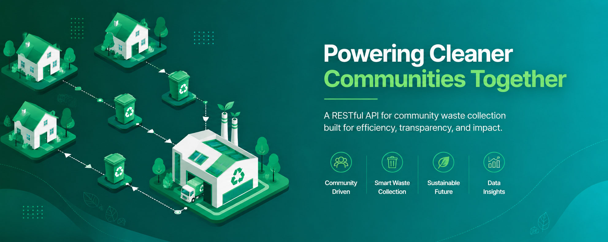
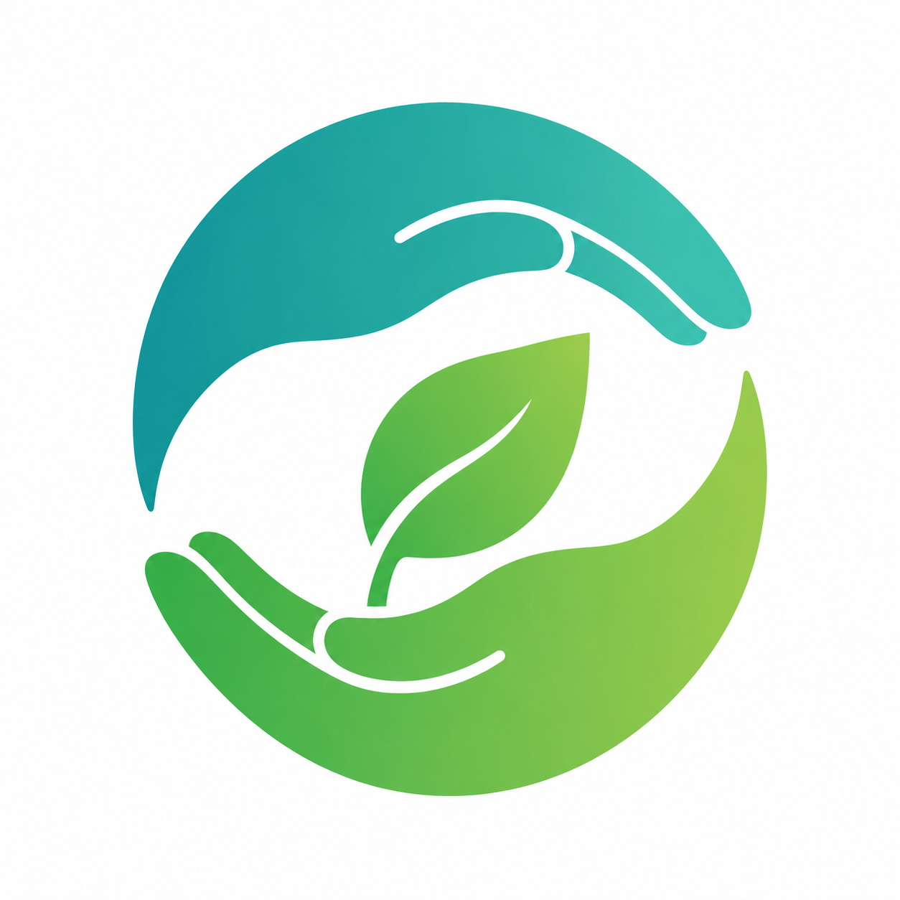
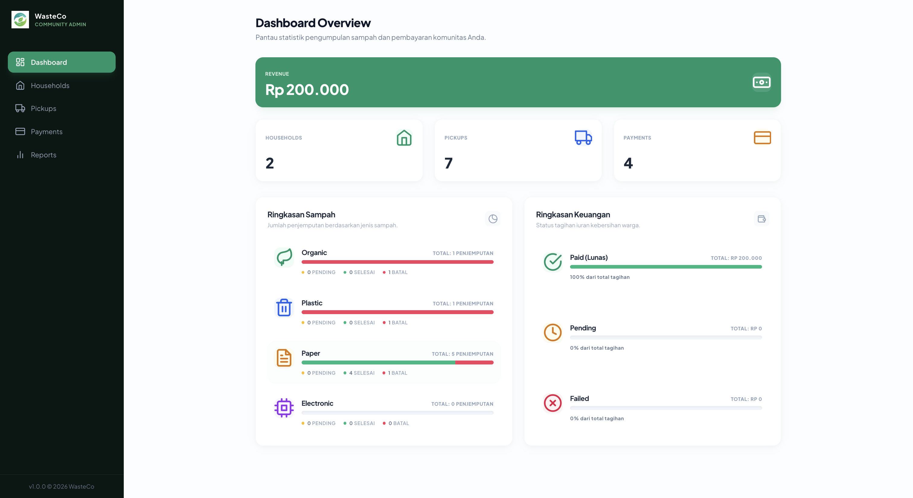
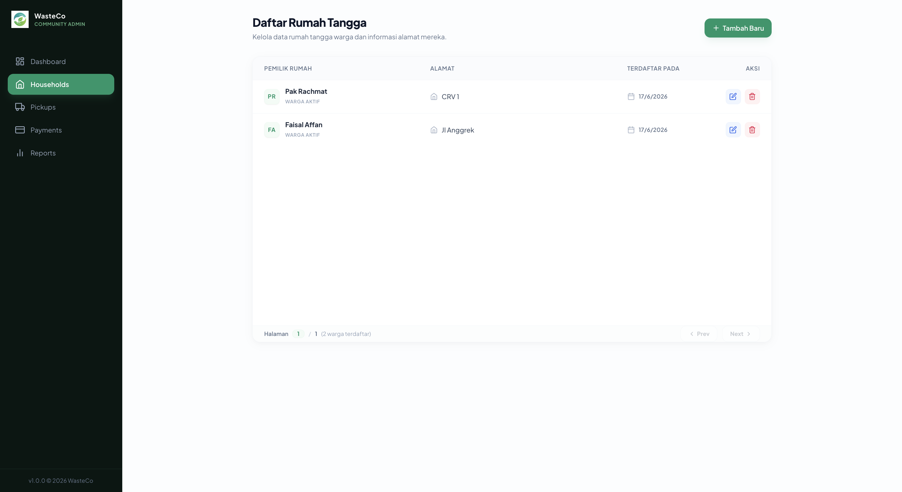
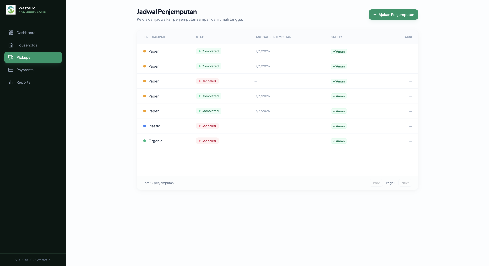
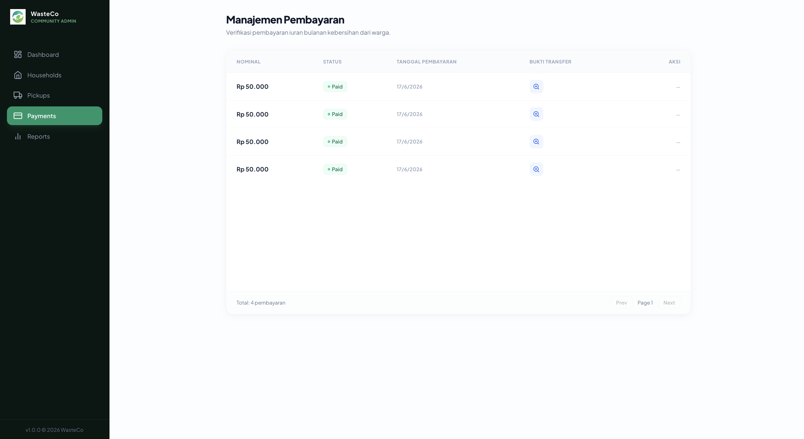
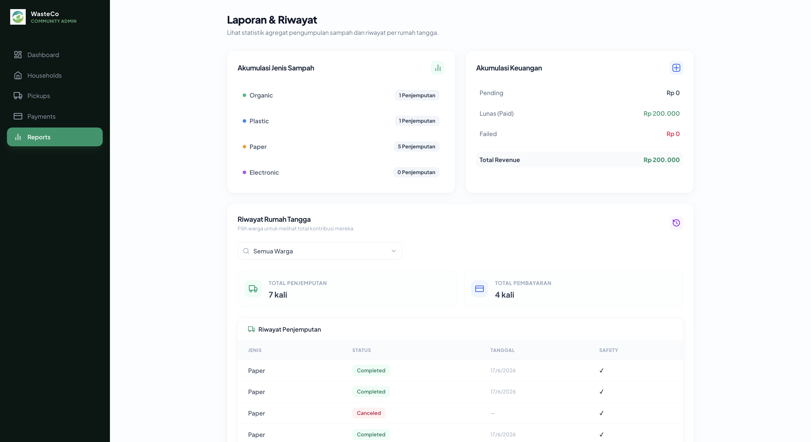
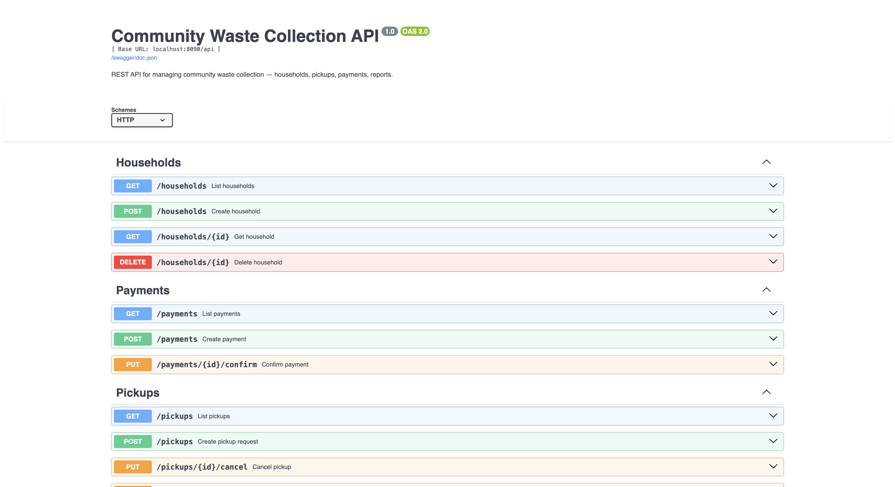
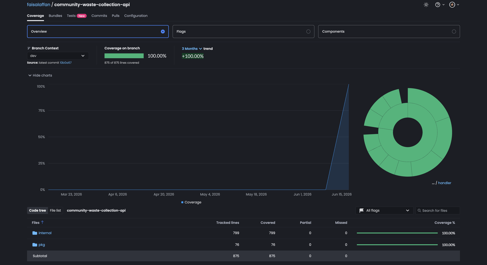
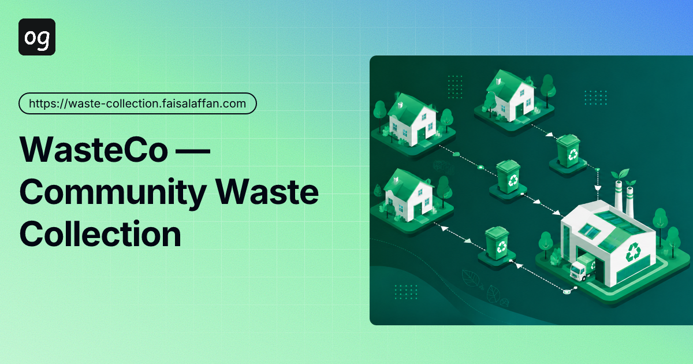

<p align="center">
  
</p>

<p align="center">
  
</p>

<h1 align="center">Community Waste Collection API</h1>

<p align="center">REST API + Admin Dashboard for community waste collection — households, pickups, payments, and reports.</p>

<p align="center">
  <a href="https://github.com/faisalaffan/community-waste-collection-api/actions/workflows/ci.yml"></a>
  <a href="https://github.com/faisalaffan/community-waste-collection-api/actions/workflows/release.yml"></a>
  
  <a href="https://codecov.io/gh/faisalaffan/community-waste-collection-api"></a>
  <a href="https://github.com/faisalaffan/community-waste-collection-api/pkgs/container/community-waste-collection-api"></a>
  
</p>

## Screenshots

<p align="center">
  
  
</p>
<p align="center">
  
  
</p>
<p align="center">
  
  
</p>

## Coverage

<p align="center">
  
</p>

<p align="center">
  <strong>243 tests — 100% statement coverage</strong> across all 11 packages.<br />
  Every repository, service, handler, middleware, storage, and router function is tested.<br />
  <em>Covered: config, handler, middleware, repository, router, service, worker, database, response, storage.</em>
</p>

## Architecture

```
cmd/server/          Entry point, DI wiring, graceful shutdown
internal/
  config/            Viper .env loader
  domain/            GORM models, DTOs, type constants
  handler/           HTTP handlers (Fiber v3)
  service/           Business logic
  repository/        Data access (GORM)
  middleware/         Rate limiter
  router/            Routes + Swagger UI
  worker/            Background goroutines
pkg/
  database/          GORM connection helper
  storage/           MinIO/S3 client
  response/          JSON response envelope
migrations/          Atlas HCL schema + config
docs/                Swagger spec
web/                 Vue 3 + Tailwind SPA
assets/              Logo + banner
```

**Stack**: Go 1.26 · Fiber v3 · GORM · PostgreSQL 16 · Atlas · Viper · MinIO · Docker · Vue 3 CDN · Tailwind CDN

## Quick Start

Prerequisites: Go 1.26+, Docker, [Atlas CLI](https://atlasgo.io/getting-started).

```bash
git clone https://github.com/faisalaffan/community-waste-collection-api.git
cd community-waste-collection-api
cp .env.example .env
make docker-up
make schema-apply
```

Admin Dashboard → `http://localhost:8080` · Swagger → `http://localhost:8080/swagger` · Postman → [Collection](assets/postman_collection.json)

## Video Tutorial

<p align="center">
  <a href="https://www.tella.tv/video/faisal-affan-backend-engineer-english-4ogm">
    
  </a>
</p>
<p align="center">
  <strong><a href="https://www.tella.tv/video/faisal-affan-backend-engineer-english-4ogm">Watch Video Tutorial →</a></strong><br />
  <em>Architecture walkthrough, API demo, deployment guide.</em>
</p>

## API Reference

Base: `/api`. Response envelope:

- **Success**: `{"status":"success","data":{}}`
- **List**: `{"status":"success","data":[],"pagination":{"page":1,"per_page":10,"total":42,"total_pages":5}}`
- **Error**: `{"status":"error","error":{"code":"NOT_FOUND","message":"..."}}`
- **Validation**: `{"status":"fail","error":{"code":"VALIDATION_ERROR","message":"...","details":[]}}`

### Households

```
POST   /api/households        Create  {owner_name, address}
GET    /api/households        List    ?page=1&per_page=10
GET    /api/households/:id    Get
PUT    /api/households/:id    Update  {owner_name, address}
DELETE /api/households/:id    Delete
```

### Waste Pickups

```
POST   /api/pickups               Create   {household_id, type, safety_check}
GET    /api/pickups               List     ?status=&household_id=&page=1&per_page=10
PUT    /api/pickups/:id           Update   {type, safety_check}
DELETE /api/pickups/:id           Delete
PUT    /api/pickups/:id/schedule  Schedule {pickup_date}
PUT    /api/pickups/:id/complete  Complete  (auto-generates payment)
PUT    /api/pickups/:id/cancel    Cancel
```

Types: `organic`, `plastic`, `paper`, `electronic`. Rate limit: 30 req/min.

### Payments

```
POST /api/payments              Create
GET  /api/payments              List     ?status=&household_id=&page=1&per_page=10
PUT  /api/payments/:id/confirm  Confirm  (multipart: proof_file)
```

### Reports

```
GET /api/reports/waste-summary           Pickup aggregation by type
GET /api/reports/payment-summary         Payment totals (pending, paid, failed) + revenue
GET /api/reports/households/:id/history  Pickup + payment history per household
```

### Files

```
GET /api/files/proof/:paymentID   Serve payment proof image (proxied from S3)
```

## Business Rules

- Pending payment → blocked from new pickup (409)
- Only `pending` pickups can be scheduled (409)
- Electronic waste requires `safety_check: true` (422)
- Organic pickups pending >3 days auto-canceled
- Completing pickup auto-generates payment (Rp 50k organic/plastic/paper, Rp 100k electronic)
- Payment confirmation requires S3/MinIO proof upload

## Database

Schema managed by [Atlas](https://atlasgo.io) (`migrations/schema.pg.hcl`).

```bash
make schema-apply      # Apply
make schema-diff       # Preview (dry-run)
make schema-inspect    # Pull from DB
make schema-dump       # Export DDL to migrations/schema.sql
```

Tables: `households`, `waste_pickups`, `payments` — UUID PKs, FK with CASCADE, B-tree indexes.

## Testing

243 tests · 100% coverage.

```bash
make test              # go test ./... -v
make coverage          # profile + summary
make coverage-html     # browser report
```

## Makefile

```bash
make build             # Build binary
make dev               # go run
make test              # Run tests
make lint              # go vet
make docker-up         # Start all services
make docker-down       # Stop all services
make swagger-clean     # Regenerate swagger
make schema-apply      # Apply Atlas schema
make schema-dump       # Export DDL to SQL
make all               # lint + test + build
```
